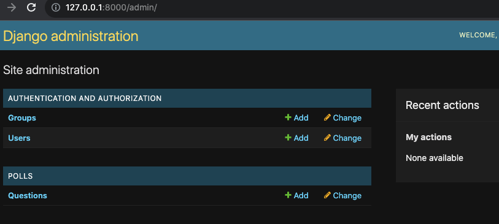
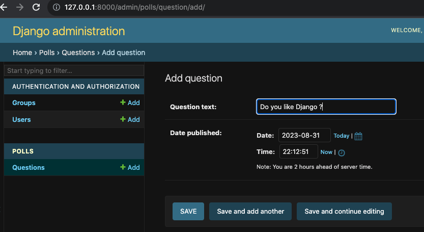
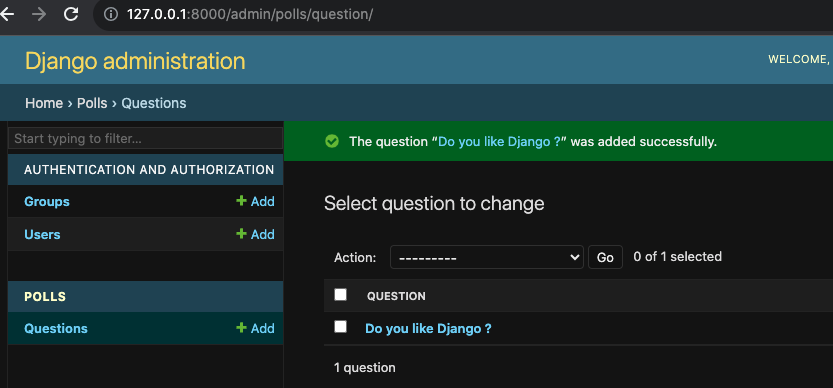

# Polls App

The purpose of the Django poll app is to illastrate the models feature, the application contains two models: Question and Choice. A Question has a question and a publication date. A Choice has two fields: the text of the choice and a vote tally. Each Choice is associated with a Question.

## Table of Contents 

- [Table of Contents](#Table-of-Contents)
- [Installation](#Installation)
- [Usage](#Usage)
- [Author](#Author)

## Installation 

### Prerequisites
`python== 3.5 or up and django==4.0`

To get started with the Prestige project, follow these steps:

1. Open the terminal.
1. Type the following command:

`git clone https://github.com/victormashego1/Polls.git`

This will clone the project to your local machine.

### To migrate the database open terminal in project directory and type
`python manage.py makemigrations`

`python manage.py migrate`

### To use admin panel you need to create superuser using this command
`python manage.py createsuperuser`

## Usage 

### To run the program in local server use the following command
`python manage.py runserver`
Then go to http://127.0.0.1:8000 in your browser

To use the Polls project, follow these steps:

1. Access `http://127.0.0.1:8000/admin`
1. Questions - to add a question and save

   ### Django administration page

   

   ### Creating a Question

   
   

   ### Results

   
   

## Author 

Victor Mashego

Email: mashegove@gmail.com
